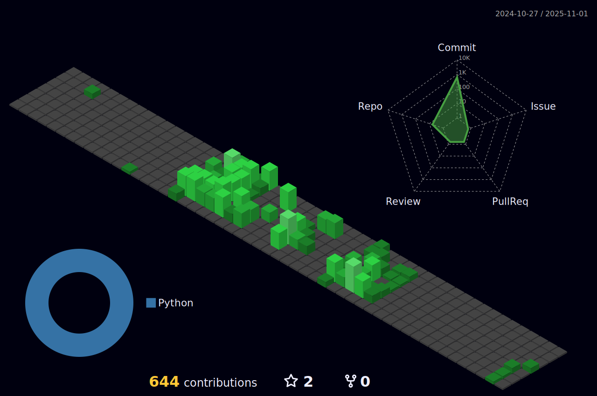

# Hi there, I'm Pardheev Krishna! 👋

Welcome to my GitHub profile! I'm passionate about coding and constantly exploring new technologies to create innovative solutions. Here's a bit about me:

## 💻 Tech Stack:

## Programming Languages

## Web Development

## Cloud and Hosting

## Databases

## DevOps and Tools

## Data Science and Machine Learning

## Design and Prototyping

## Others

### Connect with me 🤝

# 📊 GitHub Stats:

  
<!--  -->
  

### ✍️ Random Dev Quote

  

### 🔝 Top Contributed Repo

  

<!--

-->

